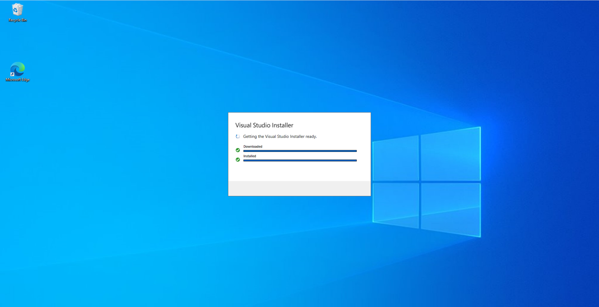
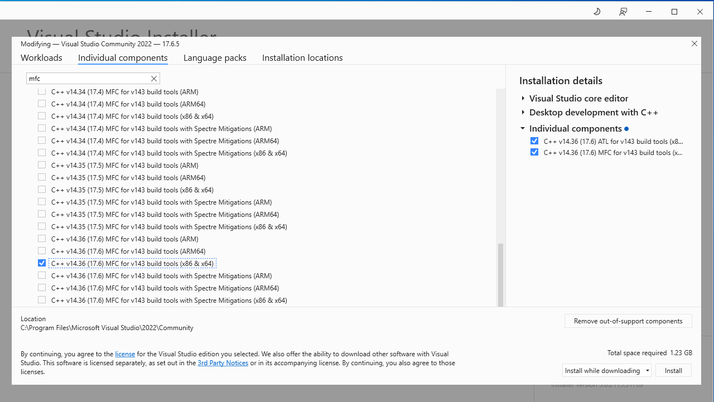
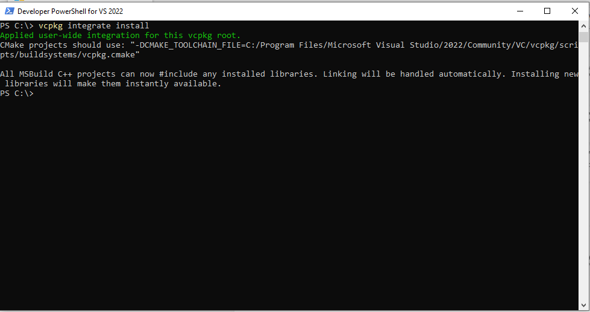
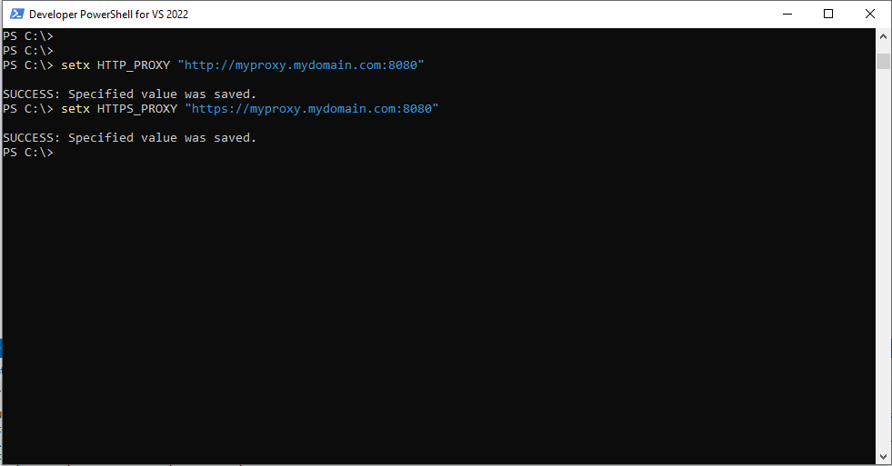
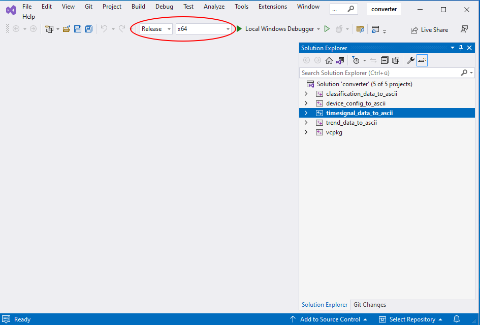
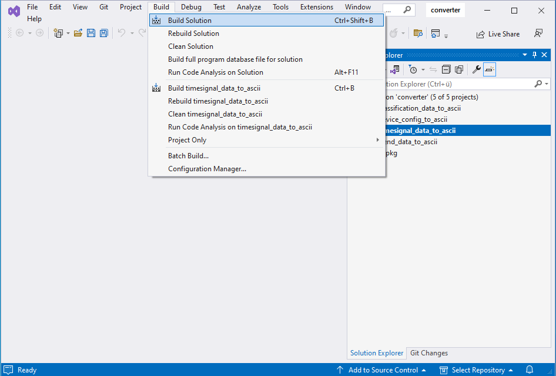

# Schaeffler SmartCheck and ProLink data converter

<!-- TOC -->
* [SmartCheck and ProLink data converter](#smartcheck-and-prolink-data-converter)
  * [Instructions for Linux](#instructions-for-linux)
    * [Required tools](#required-tools)
    * [Build](#build)
    * [Usage](#usage)
  * [Instructions for Windows](#instructions-for-windows)
    * [Tool installation](#tool-installation)
    * [Build](#build-1)
    * [Usage](#usage-1)
<!-- TOC -->

This repository provides a converter tool which allows users to unpack SmartCheck and ProLink binary data. This data is
used for example when measurement data is received via email or fetched via OPC/UA. Schaeffler provides an open-source 
tool collection to unpack this data to readable text format free of charge.

The source code in this tool converts a data container encoded in [Protobuf format](https://protobuf.dev/overview/) into an ASCII format. This is meant 
as an example how to convert the data. It can be used as is, or as a template to implement this converter in different 
programming language.

The tools can convert:
* Device configuration (settings of the device and the measurement configurations)
* Time signal data
* Trend data
* Classification data

The current code can be compiled under Linux or under Windows. Under releases, we provide pre-compiled binaries for 
Linux and Windows. The converters are backwards-compatible. This means, that we can convert the data of the current
firmware version and of previous versions. The version numbers of the converters (major and minor number) should match
or be higher than those of the used firmware.

To work with Schaeffler SmartCheck and ProLink, you should always use the latest firmware version, since this contains
the latest features and bug fixes. The firmware versions, as well as other software and supporting documents, can be 
found on our [download page](https://sls-cdn.schaeffler-iot.com/).

## Instructions for Linux

### Required tools

* Current C++-compiler
* Make
* Standard C++ libraries
* Development versions of zlib and protobuf

### Build

In the directory source, call the following command:

    ./build_all.sh

This will create the following binaries:
* classification_data_to_ascii
* device_config_to_ascii
* timesignal_data_to_ascii
* trend_data_to_ascii

### Usage

The directory example_data contains some sample files to test the converter. With the following commands, you can test 
the just created tools:

    ./bin/classification_data_bin_to_ascii doc/example_data/classification_data.sccd classification_data.txt
    ./bin/device_config_to_ascii doc/example_data/deviceconfig.scdc deviceconfig.txt
    ./bin/timesignal_data_to_ascii doc/example_data/timesignal.scts timesignal.txt
    ./bin/trend_data_to_ascii doc/example_data/trend.sctd trend.txt

The directory doc/example_data also contains these text files, so the result of the conversion. These can be used as a 
reference to check if the converters still work correctly after changes to the source code.

## Instructions for Windows

### Tool installation

To build the converter tools under Windows, a solution for Microsoft Visual Studio C++ is provided. It depends on the 
vcpkg manager, which provides the protobuf and zlib libraries, and mfc build tools. 

Download and install [Microsoft Visual Studio Installer](https://visualstudio.microsoft.com/vs/community/) (minimum 
version 17.6.5)

Open the installer and follow the instructions.

Go to Individual components and select the MFC build tool's latest version. Press Install and wait for the installation 
to be completed

Open a Developer PowerShell for VS2022 from the Windows start menu (if script execution is blocked on your computer, contact 
your administrator) and execute the following command:

    vcpkg integrate install

In case the command gives out an error message on first call, please repeat. Then close the PowerShell console.

If you are working behind a proxy server, the vcpkg tools need some extra configuration. Open a Developer PowerShell for 
VS2022 again an enter the following commands:

    setx HTTP_PROXY "http://myproxy.mydomain.com:8080"
    setx HTTPS_PROXY "https://myproxy.mydomain.com:8080"

Open the file converter.sln with the Visual Studio. Select the correct platform (usually Release and x64).

### Build

Start the build by clicking on Build Solution. The first time you compile the solution vcpkg downloads the protobuf and 
zlib packages from the internet. Please make sure to have a working internet connection.

### Usage

The directory example_data contains some sample files to test the converter. With the following commands, you can test
the just created tools:

    bin\classification_data_bin_to_ascii doc\example_data\classification_data.sccd classification_data.txt
    bin\device_config_to_ascii doc\example_data\deviceconfig.scdc deviceconfig.txt
    bin\timesignal_data_to_ascii doc\example_data\timesignal.scts timesignal.txt
    bin\trend_data_to_ascii doc\example_data\trend.sctd trend.txt

The directory doc\example_data also contains these text files, so the result of the conversion. These can be used as a 
reference to check if the converters still work correctly after changes to the source code.
